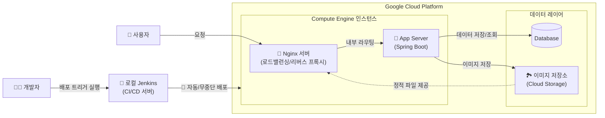

# 인프라 설계

```mermaid
flowchart LR
    
%% 외부 요소 정의
user["👥 사용자"]
dev["👨‍💻 개발자"]
jenkins["🚀 로컬 Jenkins<br>(CI/CD 서버)"]

%% GCP 인프라 서브그래프
subgraph GCP["Google Cloud Platform"]
    %% 애플리케이션 레이어 (Compute Engine 하나에 Nginx와 App Server 포함)
    subgraph ComputeEngine["Compute Engine 인스턴스"]
        Nginx["🔄 Nginx 서버<br>(로드밸런싱/리버스 프록시)"]
        svr["🍃 App Server<br>(Spring Boot)"]
    end

    %% 데이터 레이어
    subgraph DataLayer["데이터 레이어"]
        db[(Database)]
        storage["🏞️ 이미지 저장소<br>(Cloud Storage)"]
    end
end

%% 연결 관계
user -->|요청| Nginx
dev -->|배포 트리거 실행| jenkins
jenkins -->|🚀 자동/무중단 배포| ComputeEngine
Nginx -->|내부 라우팅| svr
svr -->|데이터 저장/조회| db
svr -->|이미지 저장| storage
storage -.->|정적 파일 제공| Nginx
```